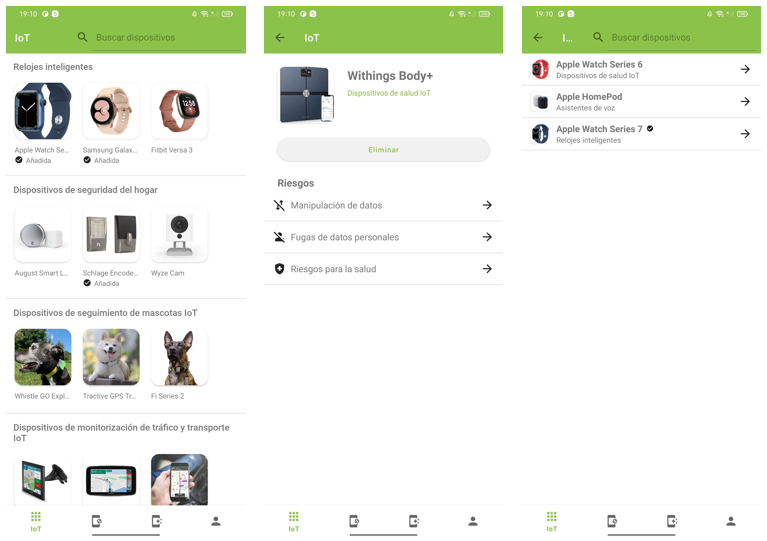
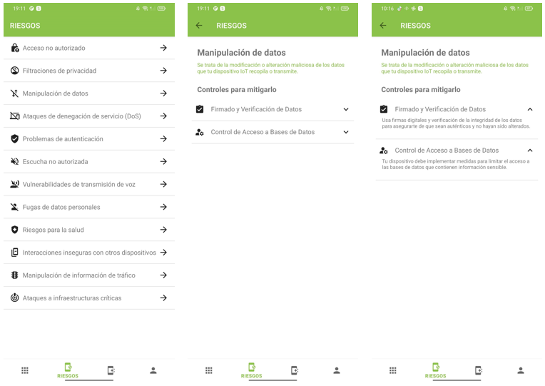
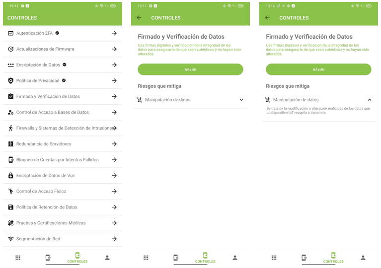
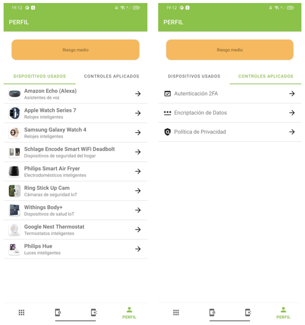

# IoTGuardian: Aplicación para la gestión de riesgos de seguridad personales asociados al uso de dispositivos IoT

## Descripción del proyecto
El auge y la expansión de los dispositivos inteligentes conectados a la red (IoT) han revolucionado nuestra vida cotidiana, ofreciéndonos comodidad y eficiencia en diversos entornos, como el hogar, la oficina, el transporte y la atención médica. Estos dispositivos, que incluyen desde televisores inteligentes hasta sensores de presencia y altavoces inteligentes, están diseñados para hacer nuestras vidas más sencillas. Sin embargo, esta proliferación también ha suscitado crecientes inquietudes en relación con la seguridad y privacidad.

Este es el punto de partida para el desarrollo de IoTGuardian, una aplicación diseñada para abordar estos retos y ofrecer a los usuarios una solución integral y eficaz para gestionar los riesgos inherentes al uso de dispositivos IoT.

IoTGuardian se compone de dos elementos principales: un servicio REST y una aplicación móvil para la plataforma Android. El servicio REST, desarrollado utilizando Spring y Java, actúa como una fuente centralizada de datos, almacenando información detallada sobre catálogos de dispositivos IoT, riesgos y controles. Esto permite a la aplicación móvil acceder a la información actualizada y brindar a los usuarios una visión completa de los riesgos asociados a los dispositivos IoT que utilizan.

La aplicación móvil está implementada en Android Studio, proporciona una interfaz intuitiva y fácil de usar para que los usuarios puedan registrar y gestionar los dispositivos IoT que utilizan. Además de ofrecer información detallada sobre los riesgos asociados a cada dispositivo, la aplicación también brinda recomendaciones personalizadas de controles para mitigar estos riesgos. Esto permite a los usuarios tomar medidas proactivas y adoptar prácticas de seguridad adecuadas mientras utilizan dispositivos IoT.

## Indicaciones
Dado que el servicio aún no está alojado en ningún servidor, es necesario ejecutarlo localmente. Para hacerlo, ve a la carpeta *IoTGuardianService/target* y ejecuta el comando *java -jar IoTGuardian-0.0.1-SNAPSHOT.jar*.

Una vez que el servicio esté en funcionamiento, podrás ejecutar la aplicación en Android Studio, pero antes deberás modificar el atributo *API_URL* en la clase *IoTGuardianApp/app/src/main/java/es/unican/iotguardian/repository/rest/IoTGuardianServiceConstants* con la dirección IP de tu propio ordenador. En la primera ejecución, los datos del servicio se descargarán automáticamente, por lo que en las ejecuciones posteriores no será necesario que el servicio esté en funcionamiento.

## Aplicación
La interfaz de la aplicación se divide en distintas secciones para facilitarte la navegación y la visualización de la información. En la sección "IoT", podrás explorar el catálogo de dispositivos IoT, realizar búsquedas y acceder a detalles específicos de cada dispositivo, incluyendo sus riesgos asociados. Además, podrás agregar o eliminar dispositivos IoT de tu perfil personal.

En la sección "Riesgos", podrás acceder a una lista de riesgos de seguridad y obtener información detallada sobre cada uno de ellos, así como los controles recomendados para mitigarlos. 

También podrás explorar la sección "Controles", donde se proporcionará una lista de controles de seguridad y su relación con los riesgos correspondientes que mitigan.

La aplicación permitirá la interacción entre las distintas secciones. Esto significa que podrás acceder rápidamente, por ejemplo, a la vista detallada de un riesgo desde la vista detallada de los dispositivos IoT. Además, se incluye una sección personal donde podrás ver tu nivel de riesgo calculado en función de los dispositivos IoT asociados y los controles aplicados. Aquí, también podrás visualizar y administrar los dispositivos IoT y controles agregados a tu perfil personal.

